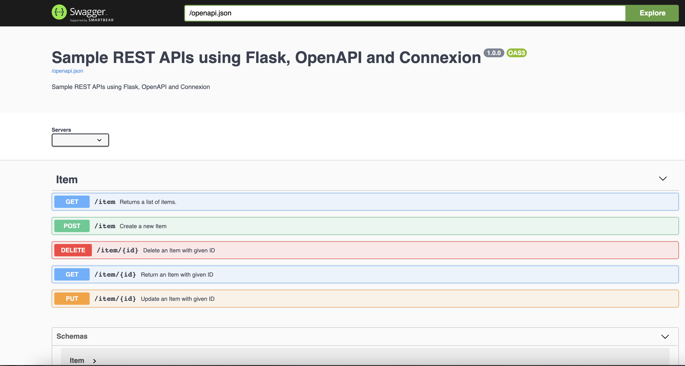

## Sample Flask application using [OpenAPI](https://swagger.io/specification/) ,[Connexion](https://github.com/zalando/connexion), [Flask-Marshmallow](https://flask-marshmallow.readthedocs.io/en/latest/) and [Flask-SQLAlchemy](https://flask-sqlalchemy.palletsprojects.com/en/2.x/quickstart/)

### OpenAPI

OpenAPI Specification (formerly Swagger Specification) is an API description format for REST APIs.
API specifications can be written in YAML or JSON. The format is easy to learn and readable to both humans and machines. The complete OpenAPI Specification can be found on GitHub: OpenAPI 3.0 Specification

### Connexion

Connexion is a framework that automagically handles HTTP requests based on OpenAPI Specification (formerly known as Swagger Spec) of your API described in YAML format. Connexion allows to write an OpenAPI specification, then maps the endpoints to Python functions; this makes it unique, as many tools generate the specification based on Python code.

## Setting up the VirtualEnv and install dependencies

Go inside the project folder and execute the below commands. We will use [Pipenv](https://pypi.org/project/pipenv/) to setup the VirtualEnv.

```
pipenv shell
pipenv install

```

Dependencies will be installed from the Pipfile. Python version 3.7 is used for this project.

## Run the Application

```
python app.py

```

This will start the application on port 5000

## Test the application

Swagger-UI can be used to test the application.


The server will start at <http://localhost:5000/ui>.

Please check my write-up for further details <https://dassum.medium.com/building-rest-apis-using-flask-restplus-sqlalchemy-marshmallow-cff76b202bfb>
